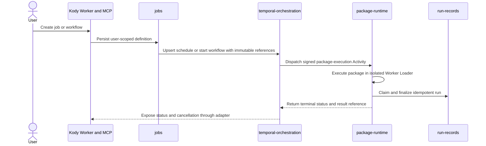

# Temporal orchestration migration plan

**Status:** Phase 8 is implemented for local development. This plan does not
select or migrate a production Temporal service, deploy Cloudflare resources,
change production namespaces, or create PR evidence.  
**Selected direction:** Option 2 — Temporal becomes Kody's durable orchestration
control plane.

Temporal will own durable orchestration. Cloudflare will continue to own edge
delivery, persistent data, realtime sessions, and isolated package execution.

This is deliberately not a wholesale replacement of every Cloudflare Worker or
Durable Object. Temporal is an orchestration engine, not a substitute for
storage, WebSockets, edge routing, or a security sandbox.

## Target architecture

| Current responsibility                                | Target                                                |
| ----------------------------------------------------- | ----------------------------------------------------- |
| `JobManager` alarms and job occurrence execution      | Temporal Schedules plus `JobOccurrenceWorkflow`       |
| `DynamicCallableWorkflow`                             | Temporal `DynamicPackageWorkflow`                     |
| Workflow timers, retries, cancellation, and fan-out   | Temporal                                              |
| Package execution coordination                        | Temporal Activity                                     |
| Untrusted package code execution                      | Keep Cloudflare Worker Loader / Workers for Platforms |
| Job definitions and schedule metadata                 | Keep `JOBS_DB`                                        |
| User-visible run history                              | Keep `RunLog`                                         |
| D1, KV, R2, and Vectorize                             | Keep Cloudflare                                       |
| Mailbox, realtime sessions, and serialized user state | Keep relevant Durable Objects                         |
| Remix, OAuth, MCP, webhooks, and edge routing         | Keep Cloudflare Workers                               |
| Operational workflow history                          | Temporal Visibility, not a user-data source of truth  |

Temporal TypeScript Workers run locally as persistent Node 26 processes against
a Temporal development server. The glibc-based container images provide an
equivalent reproducible local path; no production runtime is selected here. See
the
[Temporal Worker deployment guidance](https://docs.temporal.io/develop/typescript/workers/run-worker-process).

Cloudflare remains the untrusted-code boundary because Workers for Platforms
provides isolated customer workers. A Temporal workflow or Activity process must
never execute user package code directly. See the
[Cloudflare isolation model](https://developers.cloudflare.com/cloudflare-for-platforms/workers-for-platforms/).

<!-- system-recap:start -->
<details>
<summary>System recap — <b>adds Temporal orchestration</b> (high risk)</summary>

**Mode:** plan

**Classification:** adds — introduces a local orchestration primitive and
retires the local Cloudflare scheduling/workflow paths.

### Primitives touched

| Primitive                | Group     | Change                                                             |
| ------------------------ | --------- | ------------------------------------------------------------------ |
| `temporal-orchestration` | runtime   | Add Temporal service, Kody Worker fleet, workflows, and Activities |
| `jobs-worker`            | surfaces  | Extend for coexistence, then retire scheduling ownership           |
| `scheduled-cron`         | surfaces  | Retain for non-job maintenance lanes only                          |
| `jobs`                   | assistant | Add scheduler backend adapter and reconciliation                   |
| `workflows`              | assistant | Replace Cloudflare Workflow execution                              |
| `package-runtime`        | runtime   | Expose a narrow signed sandbox-execution gateway                   |
| `run-records`            | storage   | Remain the user-visible execution history                          |
| `durable-storage`        | storage   | Retain transactional and realtime Durable Objects                  |

### Change flow



### Invariants

- `per-user-isolation`: every contract carries authenticated ownership; no
  cross-user lookup is accepted.
- `no-secrets-in-chat`: Temporal history receives opaque references, never
  secrets or raw credentials.
- `state-vs-history`: D1 and Durable Objects remain state authorities; RunLog
  remains user history; Temporal Visibility is operational.
- `canonical-repo-source`: package execution resolves immutable source
  references before dispatch.
- Temporal retries are handled through idempotent Cloudflare claim/finalize
  operations.
- User-authored code executes only in the Cloudflare sandbox boundary.

</details>
<!-- system-recap:end -->

## Phase 0 — Freeze the contract

**Goal:** remove ambiguity before introducing infrastructure.

### Deliverables

- Create an ADR defining the Option 2 boundary and rejected alternatives.
- Add the proposed `temporal-orchestration` primitive to `primitives.yaml`.
- Produce a parity matrix for:
  - Create, update, pause, resume, and delete job.
  - Time zones and daylight-saving behavior.
  - One-time and recurring schedules.
  - Expiration.
  - Run-now.
  - Missed occurrences and catch-up.
  - Overlap behavior.
  - Retry limits and permanent failures.
  - Cancellation.
  - Account deletion and export.
- Baseline current volume:
  - Active schedules.
  - Executions per minute.
  - Peak concurrent package runs.
  - Average and maximum payload size.
  - Job lag and failure rates.
- Select the managed container runtime for the Temporal Worker fleet.
- Define Temporal namespace retention and Cloudflare/Temporal data-processing
  boundaries.

### Locked decisions

- Use separate Temporal namespaces for development, preview/staging, and
  production.
- Namespace separation is by environment, not user.
- Do not put secrets, source code, prompts, package outputs, or email bodies in
  Temporal inputs, memo, or search attributes.
- `JOBS_DB` remains the job-definition source of truth.
- `RunLog` remains the user-visible run-history source of truth.
- Temporal schedule and workflow IDs contain hashes or opaque IDs, not usernames
  or email addresses.
- Temporal preview features such as task-queue fairness are not correctness
  dependencies.

### Exit gate

- Every existing behavior has a target behavior and test.
- Expected Temporal schedule volume and Worker capacity are approved.
- Security and deletion semantics are documented.
- No implementation begins with an unresolved ownership boundary.

## Phase 1 — Build the foundation

**Goal:** establish a complete local Temporal path without moving production
traffic.

Create:

```text
packages/temporal-worker/
  src/workflows/
  src/activities/
  src/worker.ts
  src/build-workflow-bundle.ts
  test/

packages/temporal-gateway/
  src/server.ts
  src/schedules.ts
  src/workflows.ts

packages/shared/src/temporal/
  contracts.ts
  identifiers.ts
  schemas.ts
  status.ts
```

### Architecture

- `temporal-worker` contains deterministic workflows and Activity
  implementations.
- `temporal-gateway` is the HTTPS control-plane API used by Cloudflare to start,
  update, cancel, and inspect Temporal operations.
- Shared contracts contain JSON-safe types and validation only.
- Production builds pre-bundle workflow code.
- All `@temporalio/*` packages use identical compatible versions.
- Enable Worker Versioning with pinned behavior for in-progress workflows.

Add a narrow Cloudflare Activity Gateway:

```text
POST /__temporal/v1/jobs/claim
POST /__temporal/v1/jobs/finalize
POST /__temporal/v1/packages/resolve
POST /__temporal/v1/packages/execute
POST /__temporal/v1/accounts/cancel
```

This must not be a generic D1 SQL proxy. External services cannot use Kody's
Worker bindings directly, so Temporal Activities call narrowly scoped Cloudflare
operations that retain authorization and storage ownership. Cloudflare also
recommends a Worker API when an external application needs D1 access. See the
[Cloudflare D1 external-access guidance](https://developers.cloudflare.com/d1/tutorials/build-an-api-to-access-d1/).

### Gateway security

- HMAC request signing with key ID, timestamp, nonce, and body digest.
- Short replay window.
- Idempotency key on every mutation.
- Rotatable current and previous signing keys.
- Strict operation schemas and body limits.
- Network and rate-limit controls.
- No endpoint that accepts arbitrary SQL, binding names, or user-supplied URLs.
- Correlation fields: `workflowId`, `temporalRunId`, `jobId`, `runRef`, and
  hashed `userId`.

### Exit gate

- A preview Cloudflare Worker can start a test workflow through the signed
  gateway.
- A Temporal Activity can call a signed Cloudflare endpoint.
- Invalid signatures, expired signatures, and replayed requests fail.
- Temporal downtime does not affect login, MCP, package browsing, or ordinary
  Kody requests.
- Workflow replay and Worker graceful-shutdown tests pass.

## Phase 2 — Shadow Temporal schedules

**Goal:** prove schedule parity without executing anything from Temporal.

Implementation lives in the jobs worker and Temporal gateway. Job create,
update, and delete mutations write `job_schedule_bindings` plus
`job_schedule_outbox` in the same D1 batch as the authoritative `jobs` change.
This phase originally used paused sentinel Schedules. Phase 8 removed that
temporary lane. The five-minute `temporal_schedule_sync` lane now drains the
same transactional outbox into authoritative `JobOccurrenceWorkflow` Schedules,
repairs drift, and reports counts through jobs worker health.

The temporary dual path is tracked in the local-only
[Temporal cleanup tracker](./temporal-local-cleanup-tracker.md). This migration
is intentionally not attached to a GitHub issue or pull request.

Add a scheduler adapter and transactional outbox alongside the existing job
store:

- `job_schedule_bindings`
  - `job_id`
  - `user_id`
  - `backend`
  - `temporal_schedule_id`
  - `desired_version`
  - `applied_version`
  - `state`
  - `last_error`
- `job_schedule_outbox`
  - Operation ID.
  - Job and user IDs.
  - Desired operation.
  - Payload hash.
  - Retry state.
  - Timestamps.

### Historical shadow behavior

The following sequence describes the Phase 2 proof before the local Phase 8
retirement. It is not an active runtime mode:

1. Kody commits the job change and outbox operation together.
2. The reconciler creates or updates a paused Temporal Schedule.
3. Shadow comparison checks the next expected occurrence, time zone, pause
   state, expiration, and update version.
4. Temporal schedules remain paused and cannot execute.
5. Drift is surfaced in admin diagnostics and metrics.

Temporal Schedules support create, update, pause, trigger, backfill, and overlap
policies, making them the correct replacement for the custom alarm scheduler.
See
[Temporal Schedules](https://docs.temporal.io/develop/typescript/workflows/schedules).

### Exit gate

- All seeded and representative production job shapes reach parity.
- Create, update, and delete operations recover after lost responses.
- Outbox replay produces no duplicate schedules.
- Time-zone and DST cases match the existing contract.
- Reconciliation repairs manually introduced drift.
- Zero Temporal-triggered package runs occur.

## Phase 3 — Migrate scheduled jobs

**Goal:** move job occurrences from `JobManager` to Temporal by cohort.

This section records the retired cohort design. The final local implementation
uses the schedule outbox only for Temporal synchronization and has no cohort,
backend selector, or Cloudflare scheduler fallback.

The cohort implementation used the existing schedule outbox for backend
transitions. The rollout gate accepts only the planned `0`, `1`, `5`, `25`,
`50`, and `100` percent boundaries, plus an opaque internal-user allowlist. A
transition is rejected until the paused shadow is in sync and no live D1 claim
exists. `JobManager` due/next/claim queries exclude only bindings whose
committed backend is `temporal`; the reconciler then replaces the sentinel
action with `jobOccurrenceWorkflow` and unpauses it. Rollback performs those
operations in the opposite safety order.

Scheduled executions use Temporal's server-appended scheduled timestamp on the
opaque per-job Workflow ID base. Inside the Workflow,
`TemporalScheduledStartTime` becomes the D1 occurrence fence and the actual
Workflow ID becomes `runRef`. Explicit run-now/backfill starts retain the hashed
`userId|jobId|scheduledFor` ID builder. No raw owner/job identifier or package
output enters Event History.

Implement `JobOccurrenceWorkflow`:

```text
Input:
  userId
  jobId
  scheduledFor
  trigger
  runRef

Activities:
  claimJobOccurrence
  resolveExecutionPlan
  executePackageSandbox
  finalizeJobOccurrence
```

### Identity and delivery

- Schedule ID: `kody-job-v1:<hash(userId|jobId)>`.
- Scheduled Workflow ID: opaque `kody-job-occ-v1:<hash(userId|jobId)>` base plus
  Temporal's scheduled-time suffix; explicit starts use
  `kody-job-occ-v1:<hash(userId|jobId|scheduledFor)>`.
- `scheduledFor` is the occurrence fence.
- Reuse the existing `claim_token`, `claimed_scheduled_for`, lease, and
  `last_completed_scheduled_for` protections in the jobs repository.
- Delivery is at least once. Effective-once behavior comes from the existing D1
  claim/finalize fence, not from assuming Temporal Activities run exactly once.

### Cutover for one job

1. Reconcile a paused Temporal Schedule.
2. Disable new `JobManager` execution for that job.
3. Drain or repair any existing claim.
4. Set `backend=temporal`.
5. Unpause the Temporal Schedule.
6. Verify its first occurrence and RunLog result.
7. Keep the old scheduler code available but inactive for rollback.

### Rollback

1. Pause the Temporal Schedule.
2. Wait for or explicitly cancel active execution.
3. Repair expired D1 claims if necessary.
4. Set `backend=cloudflare`.
5. Rearm the user's `JobManager`.
6. Reconcile any missed occurrence using the same occurrence key.

### Rollout cohorts

- Internal test users.
- 1%.
- 5%.
- 25%.
- 50%.
- 100%.

Advance only after an observation window with:

- No unexplained duplicate terminal runs.
- No lost occurrences.
- Schedule lag within the Phase 0 baseline/SLO.
- RunLog and job-status reconciliation at 100%.
- A successful rollback drill.

## Phase 4 — Replace Cloudflare Workflows

**Goal:** replace `DynamicCallableWorkflow` without changing Kody's public
workflow API.

Implementation keeps the existing create, list, status, and cancel entrypoints.
New runs require the signed Temporal gateway settings and artifact KV binding;
missing configuration fails closed. Phase 8 removed Cloudflare Workflow
selection and mixed-backend dispatch.

Inline code, parameters, owner identity, and package caller context are split
into content-addressed, owner-scoped KV artifacts. Temporal Event History gets
only their opaque references, the requested timestamp, hashed correlation
fields, and a hashed idempotency key. The signed Cloudflare Activity gateway
loads and verifies both artifacts, executes the same package sandbox function
used by package execution, and projects running and terminal status back to
`RunLog`. A stable workflow result reference prevents a lost Activity response
from executing a completed logical operation again.

Implement `DynamicPackageWorkflow`:

```text
Input:
  workflowId (opaque)
  workflowRunId (opaque)
  userHash
  sourceRef
  requestedRunAt
  idempotencyKey (hashed)
  callerContextRef
```

### Rules

- Inline source is first stored under an immutable, owner-scoped KV/R2 reference
  with a content hash.
- Temporal receives only the immutable reference.
- `runAt` becomes a Temporal timer.
- Existing create, list, status, and cancel APIs remain stable behind a backend
  adapter.
- Statuses are mapped explicitly between Temporal and Kody's current public
  statuses.
- Cancellation propagates through heartbeat-aware Activities.
- Result and log content stay in Cloudflare storage.
- The final local implementation has no Cloudflare Workflow fallback or backend
  feature flag.

### Exit gate

- Contract tests cover every behavior documented in `docs/use/workflows.md`.
- Replayed workflow histories remain deterministic.
- Worker termination during a timer or Activity recovers correctly.
- Cancellation works before dispatch and during sandbox execution.
- Repeating the same idempotency key returns the same logical operation.

## Phase 5 — Move package execution coordination

**Goal:** let Temporal orchestrate package runs while Cloudflare remains the
execution sandbox.

Execution path:

```text
Temporal Workflow
    → executePackage Activity
    → signed Cloudflare runtime request
    → entitlement and ownership checks
    → Worker Loader isolated execution
    → RunLog finalize
    → opaque result reference returned to Temporal
```

### Requirements

- Activity heartbeats while execution is active.
- Cancellation aborts the runtime request when possible.
- Transport failures and retryable 429/5xx responses retry with bounded backoff.
- Validation, entitlement, and deterministic package failures are non-retryable.
- Every attempt uses the same invocation idempotency key.
- Existing secret host allowlists, package attribution, metering, and storage
  access remain enforced.
- Large inputs and outputs use R2/KV references rather than Temporal payloads.
- One image may serve both queues, but package Activities use a separately
  tunable task queue before production scale-up.

### Exit gate

- Cross-user execution and reference-substitution attacks fail.
- Temporal history contains no secret or package-output content.
- Killing a Temporal Worker during an Activity causes safe recovery.
- Retrying after a lost response does not execute billable effects twice.
- Timeout, cancellation, metering, and RunLog results remain consistent.
- Package execution latency stays within the approved SLO.

## Phase 6 — Migrate the remaining orchestration coordinators

**Goal:** remove Cloudflare orchestration primitives selectively.

Candidates:

- `StripePlanRefresh`.
- `OAuthPurgeCoordinator`.
- Account-deletion coordination.
- Long-running cleanup and reconciliation jobs.
- Package event fan-out where durable orchestration adds value.

Do not migrate storage/session Durable Objects:

- `Mailbox`.
- `StorageRunner`.
- `RunLog`.
- `UserMeter`.
- `RepoSession` and `RepoSessionIndex`.
- `McpClientHub`.
- `PackageRealtimeSession`.

Also retain edge-native ingress queues when their purpose is buffering provider
webhooks or email delivery. Temporal should consume business orchestration, not
every transport buffer.

Each coordinator receives its own parity, rollback, and deletion gate. Do not
bundle all Durable Object removals into one migration.

### First slice: `StripePlanRefresh`

The first coordinator uses `stripePlanRefreshWorkflow` plus signal-with-start.
Its deterministic opaque Workflow ID coalesces repeated plan-relevant activity,
and the `rescheduleStripePlanRefresh` signal moves the one-shot due time just as
the current Durable Object alarm does. Temporal history contains only the hashed
owner, timestamp, and an opaque coordinator reference; the raw stable user ID
remains in an exact-key `BUNDLE_ARTIFACTS_KV` record.

The Temporal lane requires both signed gateway settings and artifact KV. A
failed or ambiguous Temporal request does not arm another coordinator, so two
coordinators cannot race. The Activity uses
`users.stripe_plan_refreshed_at >= refreshAt` as its lost-response fence;
transient failures retry briefly in the Activity and then hourly in the
Workflow.

Parity gate:

- Repeated schedules coalesce to the latest due time.
- Missing accounts, missing Stripe customers, and deleting accounts stop without
  rearming.
- A lost Activity response cannot repeat the plan transition side effects.
- Transient Stripe failures retain the hourly backstop behavior.

Local retirement gate:

- Account deletion cancels the deterministic Temporal Workflow and deletes the
  exact Cloudflare owner-mapping artifact.
- Export remains D1-derived; coordinator metadata is not user-visible data.
- No local binding, export, feature flag, or fallback path retains the retired
  Durable Object implementation.
- Historical production migrations remain unchanged; this plan does not add a
  `deleted_classes` migration.

## Phase 7 — Production work is out of scope

Production service selection, namespace provisioning, deployment, cohorts,
dashboards, alerts, failure drills, soak evidence, rollback operations, and
remote namespace deletion are not part of this local migration. They are not
represented as pending work or as completed work in this repository change.

## Phase 8 — Retire Cloudflare orchestration

The local implementation removes:

- `JobManager` scheduling ownership.
- JobManager alarm/watchdog execution ownership. The generic cron and queue stay
  for unrelated platform maintenance lanes and Temporal Schedule outbox sync.
- `DynamicCallableWorkflow`.
- Cloudflare Workflow bindings and generated configuration.
- Backend feature flags, dual-lane adapters, and shadow reconciliation.
- Compatibility-only tests and documentation.
- Obsolete deployment and local-development configuration.

The code, bindings, exports, fallbacks, feature flags, compatibility tests, and
local configuration are retired now. The transactional jobs outbox remains a
permanent consistency boundary between `JOBS_DB` and Temporal Schedules; it is
not a dual-execution fallback. Historical production migration entries remain
untouched, and no production deletion migration is added. Do not create a GitHub
issue or pull request unless the operator later changes that decision.

### Local final gate

- `npm run typecheck` and `npm run temporal:validate` pass on Node 26.
- The focused Phase 8 regression suites pass.
- Multi-worker local development proves origin, platform, and runtime
  forwarding.
- Local D1 migrations replay idempotently, and jobs, runtime, and platform
  Wrangler dry builds pass.
- No active local configuration references the retired classes or bindings.
- Repository search finds no stale feature flag, dual write, or active adapter.
- Disaster recovery, account deletion, and export documentation reflect the
  final architecture.

`npm run validate` remains the authoritative repository-wide local gate. This
work does not authorize a PR or deployment.

## Local execution structure

Use local checkpoints with independent proof:

1. ADR, taxonomy, contracts, and parity matrix.
2. Temporal Worker skeleton, local development, and deterministic tests.
3. Signed Temporal and Cloudflare gateways.
4. Schedule outbox and paused shadow schedules.
5. `JobOccurrenceWorkflow` and claim/finalize Activities.
6. Job cohort controls, metrics, and rollback tooling.
7. `DynamicPackageWorkflow` adapter.
8. Sandbox-dispatch Activity and cancellation.
9. Remaining coordinator migrations.
10. Cloudflare orchestration retirement in local code and configuration.
11. Node 26 and multi-worker Windows verification.

Observability and failure-test work can proceed alongside Phases 2–5. The
critical path is:

```text
Contract freeze
  → Temporal foundation
  → Shadow schedules
  → Job cohort cutover
  → Dynamic workflows
  → Package execution
  → Cloudflare orchestration removal
```

The strongest rule for the entire migration is: **never allow Cloudflare and
Temporal to execute the same job occurrence concurrently**. Shadow metadata is
safe; shadow execution is not.
