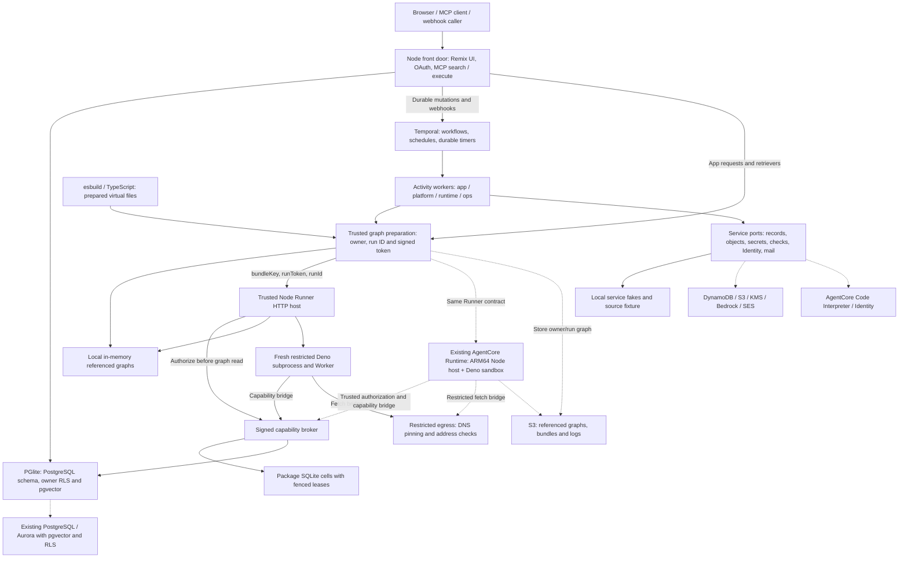

# Kody — Temporal + AgentCore POC

Kody is a personal assistant home for memories, packages, secrets and
automation, accessible through OAuth-protected MCP `search` and `execute` and a
Remix UI. Every signed-in user has isolated rows, package storage and run
records.

P0–P8 are recorded complete for an isolated migration POC. The repeatable local
demo is implemented and verified. Live AWS adapters and a buildable AgentCore
Runner host are available; all nine live service proofs remain pending in the
recorded [readiness evidence](docs/poc/readiness.md). Production provisioning,
deployment, data migration and cutover remain outside this POC.

The Deno package-execution replacement is complete locally. Verification on
2026-10-05 passed all 14 validation gates, 3,632 Node tests, the focused POC and
MCP suites, retained browser journeys and demo/reset/repeat. The ARM64 Docker
image builds and its non-root, network-disabled smoke test passes. See
[package execution evidence](docs/poc/package-execution.md) for commands, counts
and the distinction between local checks and pending AWS proofs.

## Tech stack

| Layer                              | Technologies                                                                | Role in this POC                                                                                      |
| ---------------------------------- | --------------------------------------------------------------------------- | ----------------------------------------------------------------------------------------------------- |
| Language and runtime               | TypeScript 6, Node.js 26+, npm 11 workspaces                                | Application server, service adapters, tooling and the two-package workspace                           |
| Web UI                             | Remix 3 release candidate, Vite 8                                           | Browser UI, development modules and client/SSR builds                                                 |
| Agent interface and authentication | MCP TypeScript SDK, OAuth, Zod                                              | Authenticated `search` / `execute` tools and input validation                                         |
| Durable orchestration              | Temporal server and TypeScript SDK                                          | Workflows, activities, schedules, timers and worker recovery                                          |
| Package execution                  | Deno sandbox; AWS AgentCore Runtime host                                    | Execute compatible published module graphs behind the capability broker and egress proxy              |
| Package bundling and checks        | esbuild; TypeScript                                                         | Trusted dependency preparation, virtual-file bundling and publish diagnostics                         |
| AWS execution and connectors       | AWS SDK for JavaScript v3, AgentCore Runtime, Code Interpreter and Identity | Live sandbox adapters/proofs; standalone Runtime artifact uses Node and pinned Deno                   |
| Relational data and search         | PostgreSQL, pgvector, PGlite, `pg`                                          | Owner RLS and vector search; PGlite runs locally, PostgreSQL/Aurora has a separate live proof         |
| Package storage                    | SQLite                                                                      | Package-owned storage cells with fenced leases                                                        |
| AWS data and AI services           | DynamoDB, S3, KMS, Bedrock embeddings, SES                                  | Quotas/run records, objects, secret envelopes, embeddings and email; explicit fakes in the local demo |
| Testing and code checks            | Vitest, Temporal testing SDK, Playwright, TypeScript, Oxlint, Oxfmt         | Unit/integration, workflow/activity, browser, type, lint and formatting checks                        |

The application server runs on Node.js. `packages/worker` is the retained
directory name. Authored Cloudflare package APIs retain compatibility adapters,
and the OAuth/code utilities remain; the POC does not run the application on the
hosted Cloudflare Workers platform. AWS technologies listed here have live
adapters or proof commands; their verification status is recorded separately
from the local demo.

The [package execution replacement](docs/poc/package-execution.md) uses pinned
Deno 2.9.7 and installed esbuild/TypeScript throughout the local launcher and
package toolchain. Workerd and worker-bundler execution dependencies are
retired. Failed dispatch never falls back to another backend.

## Local demo workflow

Use Node 26+, npm 11, Git, curl and tar from the repository root. Start the
launcher in one terminal:

```bash
HUSKY=0 npm ci --ignore-scripts --no-audit --no-fund
HUSKY=0 npm rebuild --no-audit --no-fund
npm run demo
```

No `.env` or real credentials are required. The launcher starts the Node app,
Vite/Remix UI, Temporal development server, four Temporal worker pools and Deno
runner host, then seeds synthetic users and a report package. It prints the
loopback application and Temporal UI URLs; their default ports are 3742
and 8233. Temporal and pinned Deno need one-time executable downloads;
restricted environments can set `KODY_TEMPORAL_EXECUTABLE` to an existing
Temporal CLI and `KODY_DENO_EXECUTABLE` to the pinned Deno binary.

Sign in as `alice@example.invalid` with `demo-password-123`. In a second
terminal, run the combined walkthrough:

```bash
npm run demo:run
```

Allow approximately 10–15 minutes to follow the printed browser links and
workflow IDs:

1. **Memory and MCP:** discover the OAuth-protected `search` and `execute`
   tools, save an approved synthetic memory, search it and inspect Alice's
   memories in the UI.
2. **Edit and publish:** open a Git-backed report session, edit its application
   export, check and publish it, then open the published output. The source
   service and interpreter results use local fixtures; package manifest,
   documentation and bundling checks run locally.
3. **Webhook idempotency:** deliver the same HTTP webhook twice with one
   idempotency key. Verify a replay response and exactly one report storage row.
4. **Scheduled automation:** fire a one-time package schedule and inspect its
   workflow in Temporal and its run in Alice's activity page.
5. **Retry and recovery:** trigger a controlled failure before package
   execution, verify the safe retry produces one row, then restart the worker
   pools during a deferred run and observe completion after they reconnect.
6. **Owner isolation:** sign in as `bob@example.invalid` with the same demo
   password. Verify Bob cannot read Alice's private memories, package, package
   storage or run records.

Reset and repeat while the launcher stays running:

```bash
npm run demo:reset
npm run demo:run
npm run demo:check
```

State lasts for one launcher session. Worker restart preserves Temporal and the
stores; reset recreates only demo-owned state. Ctrl+C stops owned processes and
removes temporary fixtures. `npm run dev` uses the same launcher. No external AI
model or MCP host is needed. See the [presenter walkthrough](docs/poc/demo.md).

## High-level POC architecture

Temporal coordinates durable work; package code runs only in fresh Deno
sandboxes. Direct requests and activities share graph preparation, run
authorization and the same Runner contract. Solid paths run locally; dotted
paths are optional AWS adapters/proofs and remain pending sandbox configuration.



One local Temporal namespace hosts the `app`, `platform`, `runtime` and `ops`
task queues. Durable mutations, webhooks, jobs, repository sessions and mail use
workflows/activities. App requests and retrievers may invoke the Runner
directly. Workflow IDs, broker authorization, database RLS, object keys and
package storage carry owner scope. Published module graphs retain the existing
package runtime API, URLs and grants. Package code accesses capabilities through
the broker and restricted egress; AWS credentials stay outside the package
sandbox.

The Node host retains run tokens and trusted service clients. Package code
cannot read host environment variables or files, open direct sockets, start
subprocesses or download dependencies. Each invocation has bounded output,
cancellation and a deadline; its subprocess and temporary files are disposed
afterward. The local Docker smoke test verifies environment/filesystem and
metadata/localhost socket denial, not deployed AgentCore IAM or
credential-metadata isolation.

| Component                      | Local demo                                   | Real AWS POC destination / proof                                   |
| ------------------------------ | -------------------------------------------- | ------------------------------------------------------------------ |
| HTTP, UI and MCP               | Real Node, Vite/Remix and OAuth              | Cloud front door deployment remains deferred                       |
| Orchestration                  | Real Temporal server and four worker pools   | Cloud transport, TLS, namespaces and Nexus remain deferred         |
| Relational data / search       | PGlite, PostgreSQL schema/RLS and pgvector   | Existing PostgreSQL/Aurora owner isolation and vector-search proof |
| Package execution              | Fresh restricted Deno sandboxes              | Existing kody-deno-v1 AgentCore Runtime host                       |
| Package storage                | Real SQLite cells with fenced leases         | Cell service deployment remains deferred                           |
| Quotas, claims and run records | In-memory DynamoDB fakes                     | Existing DynamoDB tables                                           |
| Graphs, bundles and logs       | In-memory S3 fake                            | Existing S3 bucket                                                 |
| Secret envelopes               | Context-enforcing KMS fake                   | Existing KMS key                                                   |
| Source / publish checks        | Git fixture and scripted interpreter results | AgentCore Code Interpreter proof; CodeCommit/CodeArtifact deferred |
| Connector tokens               | Imported-token vault fake                    | Pre-authorized AgentCore Identity user/provider                    |
| Embeddings / email             | Deterministic embeddings and SES outbox fake | Bedrock embeddings and SES mailbox simulator                       |

See [POC architecture](docs/poc/architecture.md) and
[remaining implementation limits](docs/migration/p8-shortcuts.md).

## Real AWS and Temporal POC workflow

The supported live entry point is **individual AWS sandbox service proofs**, run
alongside the local Temporal demonstration. `npm run demo:aws:check` invokes
live SDK adapters; its configured Runtime proof starts a real local Temporal
workflow whose activity invokes an existing Deno host and calls the signed
broker. It does not switch the local launcher to AWS. The integrated live proof
requires existing service wiring and remains unverified without configuration.

The intended integrated execution path is:

1. An authenticated request, admitted webhook or Temporal Schedule starts
   owner-scoped durable work. Temporal records workflow history and dispatches
   activities to the appropriate worker queue.
2. A trusted activity prepares the referenced package graph, stores it in S3,
   registers the run with the capability broker and supplies a signed run token.
3. The AgentCore Runner adapter calls the configured Runtime with a session ID
   derived from the owner and run ID, and an invocation containing `bundleKey`,
   `runToken` and `runId`. Module bytes stay in S3.
4. The Runtime HTTP host asks the trusted broker to authorize the token and run,
   verifies the exact owner/run graph key, reads it from S3 and executes it in a
   fresh Deno sandbox. Capability and network calls pass through the broker and
   egress proxy to owner-scoped storage/services.
5. Activities record outcomes and logs through the data/service ports and return
   results to Temporal. Workflow history supports recovery after workers
   reconnect. Retry policy depends on the activity: the demo's controlled
   pre-execution failure is retryable; handlers with uncertain side effects
   retain single-attempt policies.

To exercise the available live proofs:

1. Obtain access to **existing sandbox resources** and use a separate shell with
   AWS's credential provider chain. Keep AWS proof configuration separate from
   `.env.example`, `.env.test` and the demo launcher's environment.
2. Copy the minimal configuration and add only the service sections to test:

   ```bash
   cp tools/demo/aws.example.json /tmp/kody-poc-aws.json
   ```

   Set the sandbox `region`. For Runtime, add `runtime.arn`,
   `protocol: "kody-deno-v1"`, `broker: { port, publicUrl }` and `s3.bucket`.
   The existing host's HTTPS broker ingress must forward to the proof listener.
   The proof creates only synthetic UUID-owned graph/result objects and a
   temporary registered broker run. See
   [AWS configuration and prerequisites](docs/poc/aws.md) for the PostgreSQL,
   DynamoDB, S3, KMS, interpreter, Identity, embeddings and SES sections. The
   example contains only a region; copying it alone leaves the proofs pending.

3. Prepare and verify the local ARM64 host artifact with Docker:

   ```bash
   npm run demo:runner:build
   docker build --platform linux/arm64 -t kody-runner-local dist/runner
   docker run --rm --platform linux/arm64 --network none \
     --mount "type=bind,src=$PWD/tools/demo/runner-image-smoke.mjs,dst=/tmp/smoke.mjs,readonly" \
     --entrypoint node kody-runner-local /tmp/smoke.mjs
   ```

   This writes `dist/runner` with the bundled Node/Deno host and an ARM64 Docker
   build context. The host exposes POST `/invocations` and GET `/ping` on
   port 8080. Its environment requires `AWS_REGION`, `S3_BUCKET_BUNDLES`,
   `BROKER_URL` and `EGRESS_URL`; its role needs graph-read access. Trusted
   HTTPS endpoints and broker run registrations must already be reachable. The
   smoke test uses a synthetic broker and graph inside the container; nothing is
   pushed or deployed. The live proof requires an existing compatible
   `kody-deno-v1` Runtime. Container deployment and distributed broker wiring
   remain outside this POC; deployed Runtime invocation is pending
   configuration.

4. Run the configured service proofs:

   ```bash
   KODY_DEMO_AWS_CONFIG=/tmp/kody-poc-aws.json npm run demo:aws:check
   ```

5. Inspect [AWS evidence](docs/poc/aws-evidence.json) for each service's
   `passed`, `failed` or `pending` status and sanitized evidence. Configured
   failures cause a nonzero exit; missing resources, incompatible Runtime or
   missing Identity consent stay pending without fake fallback. Proofs clean up
   their own rows/objects and temporary sessions/registrations; SES sends to its
   mailbox simulator.

Run `npm run demo:run` separately to demonstrate Temporal scheduling, safe retry
and worker recovery. Passing both sets establishes local workflow behavior and
the selected live service contracts; it does not establish an integrated cloud
deployment. Production networking, persistent cloud stores, telemetry, backups
and realtime delivery remain future work.

## Repository and verification

| Directory         | Responsibility                                                |
| ----------------- | ------------------------------------------------------------- |
| `packages/worker` | Node front door, MCP, Remix, Temporal, AWS ports, Deno Runner |
| `packages/shared` | Portable domain and runtime contracts                         |
| `tools/demo`      | Launcher, scenarios and optional live service proofs          |
| `docs/poc`        | Presenter instructions, architecture, fresh evidence          |
| `planss`          | Local migration plans; ignored for new files                  |
| `docs/audits`     | Local historical reports; ignored for new files               |

`CI=1 npm run validate` remains the authoritative gate. Focused demo checks, MCP
end-to-end tests, browser journeys and client/SSR build provide additional
readiness evidence. See [checks](docs/contributing/setup/checks.md),
[AGENTS.md](AGENTS.md), [contributor documentation](docs/contributing/index.md),
[using Kody](docs/use/index.md). Local plans and historical audits remain on
disk; ignore rules do not remove files that Git already tracks. Current
architecture and reproducible verification evidence live in `docs/poc`.

## License and contribution

Kody retains the
[Functional Source License, Version 1.1, ALv2 Future License](LICENSE). Each
version becomes Apache License 2.0 on its second anniversary. Repository
contributions require the
[inbound CLA](docs/contributing/inbound-contributions.md); published packages
have no repository CLA or license gate. See [CONTRIBUTING.md](CONTRIBUTING.md).
Original Epic Web attribution remains in source and licensing files.
